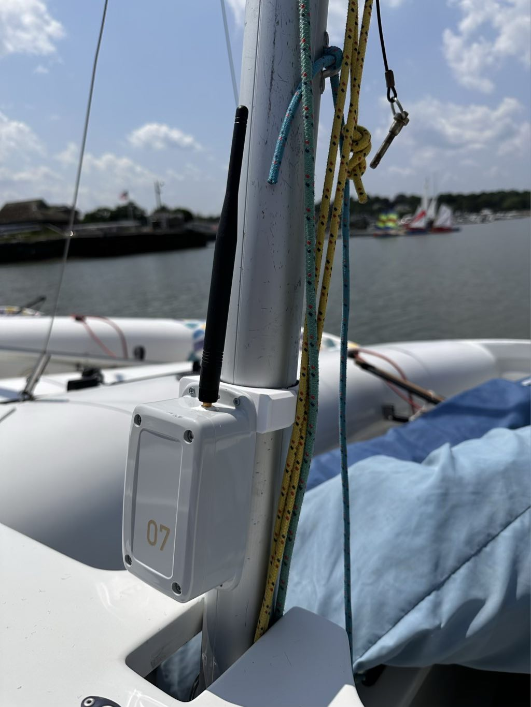
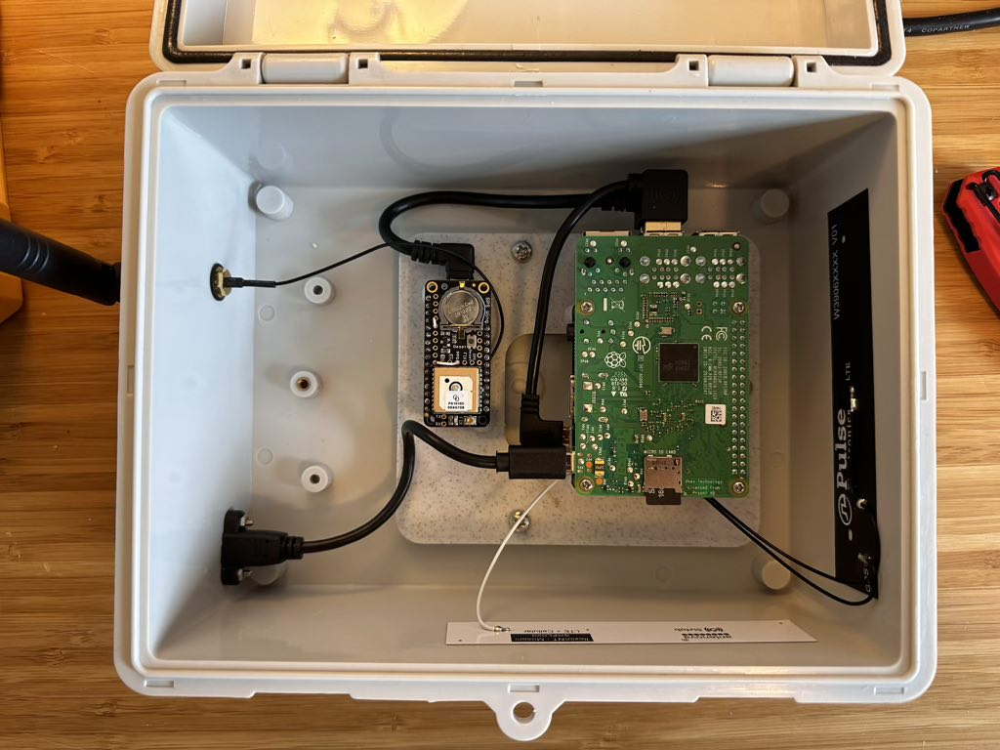

# NauticNet 3D Models

This repository contains Autodesk Fusion 360 project files (.f3d) and STL files for custom components required to construct the NauticNet system.

Each directory has its own README with more specifications.

## [NMEA Logger](./logger/)

## [Tracker Mini](./tracker_mini/)

## [Tracker Mini Uplink](./uplink/)

