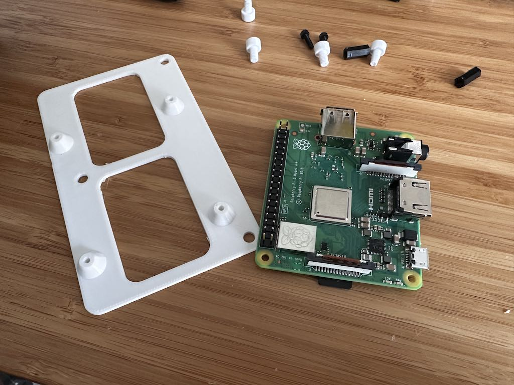
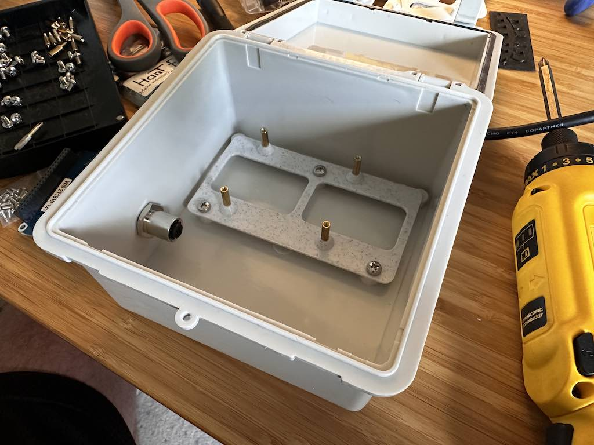
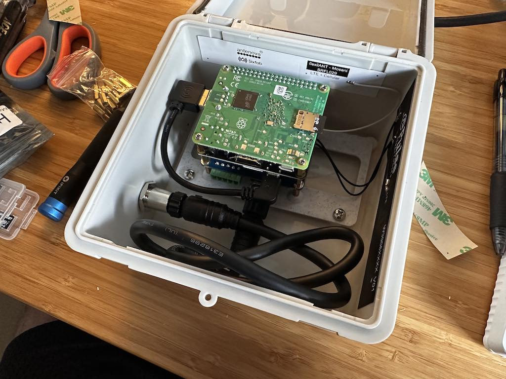

# NauticNet NMEA2000 Logger PCB Sled

These are the companion files to [nautic_net_device](https://github.com/opensailing/nautic_net_device)

- [Complete bill of materials (BOM)](https://docs.google.com/spreadsheets/d/1K5JX2X3StzlSUvMe3grGCA3HCjzsOJwOJrZuGtvl2_4/edit#gid=0)

## Hardware

- [Zulkit Junction Box ABS 5.9 x 5.9 x 3.5 inch](https://www.amazon.com/Zulkit-Dustproof-Waterproof-Electrical-150x100x70mm/dp/B08KWD8TFY/ref=sr_1_24?crid=3GN4RO4TLAON5&keywords=waterproof%2Benclosure&qid=1684959845&sprefix=waterproof%2Benclosure%2Caps%2C89&sr=8-24&th=1) - enclosure
- [M4 x 0.7mm Thread x 6mm pan head Phillips screw](https://www.mcmaster.com/catalog/129/3394/90116A202) - secures PCB sled to enclosure
- [M2.5 x 12mm standoff](https://www.amazon.com/gp/product/B07KM27KC6/ref=ppx_yo_dt_b_asin_title_o00_s00?ie=UTF8&psc=1) - between cellular HAT and PICAN HAT, and between PICAN HAT and sled
- [M2.5 x 11mm standoff](https://www.amazon.com/gp/product/B07KM27KC6/ref=ox_sc_act_image_2?smid=A1EKVK0A8LNZH7&psc=1) - between Pi and cellular HAT

